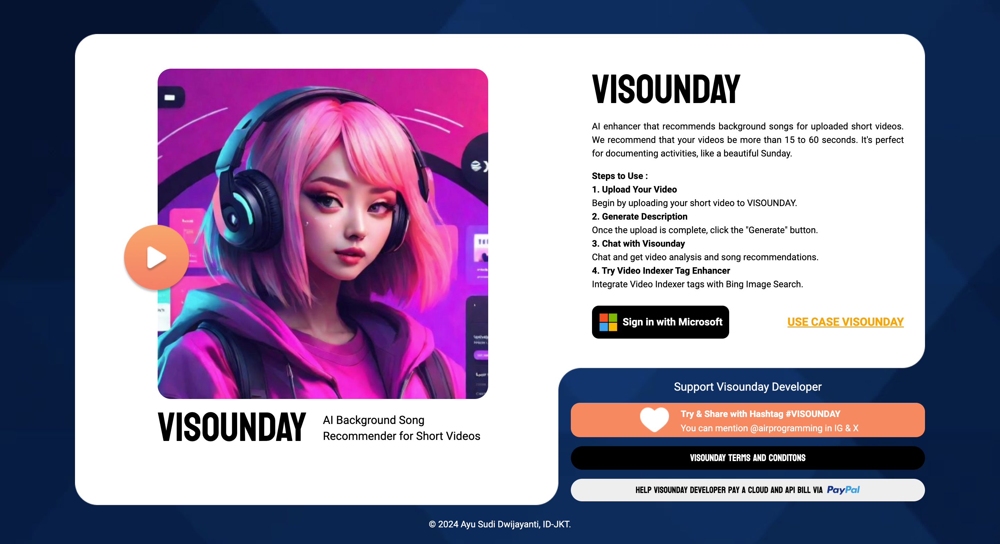
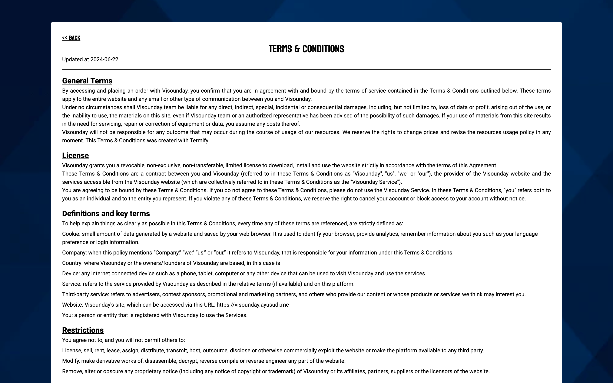

# Visounday Client

## Topics
- Public URL Access 
- Technology Stack Used
- Screenshots
- How to Run the Application


### Public URL Access

[https://visounday.ayusudi.me](https://visounday.ayusudi.me)
[https://visounday.vercel.app](https://visounday.vercel.app)


### Technology Stack Used 

| No  | Tech Stack / Package |
|-----|----------------------|
| 1.  | React                |
| 2.  | React Router         |
| 3.  | Vite                 |
| 4.  | Tailwind & Flowbite  |
| 5.  | React Markdown       |
| 6.  | Cloudinary           |
| 7.  | Axios                |
| 8.  | Sweetalert2          |

> For more detail check it on package.json

### Screenshots 

- Landing Page 

- Use Case Page 
 
- Terms & Conditions Page

- Dashboard Page 

- Chat Page 

- Video Indexer Enhancer Page

- Not Found Page


### How to Run the Application

> Note: You will be unable to run this application unless you have Cloudinary and Microsoft authentication via Firebase. You must modify the code that interacts with the API as necessary.

1. Git clone this repository 
2. Open terminal 
3. Navigate to this repository 
4. Create file .env and take a list of .env on `.env.template` 
```
VITE_FIREBASE_APIKEY=
VITE_FIREBASE_AUTHDOMAIN=
VITE_FIREBASE_PROJECTID=
VITE_FIREBASE_APPID=
VITE_FIREBASE_MEASUREMENTID=
VITE_CLOUDINARY_CLOUD=
VITE_CLOUDINARY_APIKEY=
VITE_CLOUDINARY_UPLOADPRESET=
```
5. Install the package 
```
npm install 
```
6. Run application
```
npm run dev
```